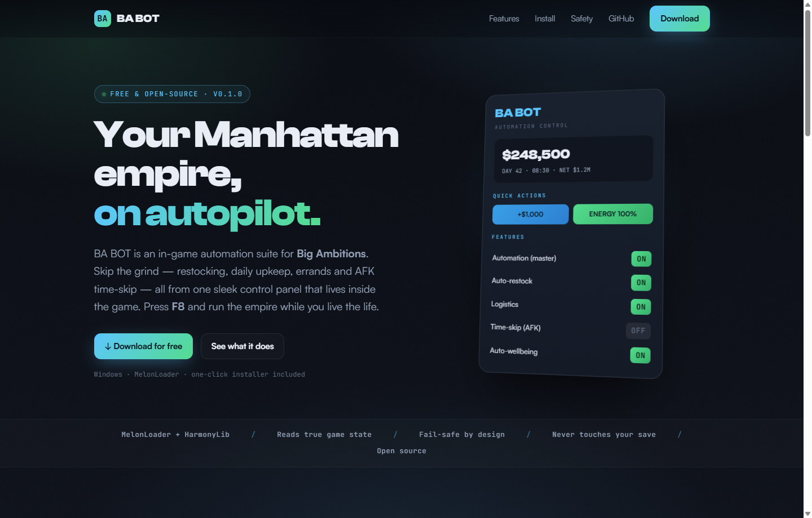

<div align="center">

# 🎛️ BA BOT

### Your Big Ambitions empire, on autopilot.

An in-game automation suite for **[Big Ambitions](https://store.steampowered.com/app/2127390/Big_Ambitions/)** — skip the grind (restocking, upkeep, errands, AFK time-skip) from one sleek control panel that lives inside the game. Press **F8**.

[**🌐 Website**](https://itsrealdennis.github.io/BigAmbitionsAutomation/) · [**⬇️ Download**](https://github.com/ItsRealDennis/BigAmbitionsAutomation/releases/latest) · [**🐛 Issues**](https://github.com/ItsRealDennis/BigAmbitionsAutomation/issues)


<br>



<sub>Hover any toggle in-game for a tooltip explaining what it does.</sub>

</div>

---

## ✨ Features

| | Feature | What it does |
|---|---|---|
| 🎛️ | **In-game control panel** | Polished F8 overlay styled to match the game — live cash, day & net worth, every toggle a tap away. |
| ⚡ | **Instant quick-actions** | One-click **+$1,000** and **Energy 100%** — useful the second you spawn, no shop needed. |
| ⏩ | **Time-skip (AFK)** | Fast-forwards the clock while your businesses keep earning. |
| ❤️‍🩹 | **Auto-wellbeing** | Keeps your energy topped up so you never stop to sleep/eat. |
| 🛡️ | **Click-safe overlay** | Panel clicks never leak into the world (hooked into the game's input layer). |
| 💾 | **Persistent settings** | Toggles + reserve floor saved across sessions. |
| 🇩🇰 | **English & Dansk** | Full English/Danish UI — switch in the panel; remembered across sessions. |
| 🔍 | **Preview-first & safe** | Every money move previews what it would do; flip **Live mode** on only when watching. Reserve floor + safety breakers never crossed. |
| 💰 | **Finance auto-pay** | Pays your taxes the moment they come due — the one money chore the game won't do for you. Reserve-floor gated. |
| 👔 | **Employees** | Morale bonus to unhappy staff when the game allows one, and completed training finished automatically. |
| 🎓 | **Train a person** *(preview)* | A **SKILLS** panel lists your staff — click **MAX** on anyone to bring their skill straight to 100%. Pick who you want; it does the rest. |
| 🚚 | **Logistics** | Sets up a repeating weekly import for any product running low, so stock keeps flowing. |
| 📦 | **Auto-restock** *(preview)* | Reads each shop's stock and restocks to target on the daily tick, gated by your reserve floor. |
| ⚖️ | **Service fee** *(opt-in)* | Optional challenge: charges in-game cash when automation does work for you, so leaning on the bot isn't free. Off by default; tune the fee in the panel. |

Automation is **default-OFF** and runs only through a plan → safety-gate → apply pipeline. Money-spending actions **preview** (log what they'd do) until you enable **Live mode** in the panel.

## ⬇️ Install (players)

**Everything's in the zip — MelonLoader included. Nothing else to download.**

1. Download the latest release: **[BA-BOT-v*.zip](https://github.com/ItsRealDennis/BigAmbitionsAutomation/releases/latest)** and unzip. Inside are just two things: **`Install BA BOT`** and the bundled **`MelonLoader Installer.exe`**.
2. Double-click **`Install BA BOT`**. It auto-detects your game. If MelonLoader is missing, click **“1 · Install MelonLoader”** — it opens the bundled installer for you (point it at Big Ambitions, install, launch the game once). On Windows 11, turn **off Smart App Control** if asked (it blocks unsigned mods).
3. Back in the window, click **“2 · Install BA BOT”**.
4. Launch the game and press **F8**.

To remove: open the `files` folder and run `uninstall.bat`. *(Prefer a text installer? `files\install-console.bat`.)*

## 🛡️ Built to fail safe

- **Default-OFF** — does nothing until you opt in, feature by feature.
- **Reserve floor & shared budget** — never spends below the cushion you set, checked against the whole plan.
- **Safety breakers** — low funds / unpaid rent / empty inventory halt automation and say why.
- **Never writes your save** — settings live outside the save file; uninstall any time and load vanilla, clean.

## 🧱 Architecture (for developers)

The testable "brain" never touches the volatile game API:

| Project | TFM | Role |
|---|---|---|
| `src/BAA.Core` | net6.0 | The brain. **Zero game refs.** Orchestration engine, safety gate + breakers, managers, config, adapter interfaces. Pure + unit-tested. |
| `src/BAA.Mod` | net6.0 | The MelonLoader mod — the **only** project that touches the game/IL2CPP (adapter, Harmony hooks, IMGUI overlay). |
| `tests/BAA.Core.Tests` | net8.0 | xUnit (18 green) against in-memory fakes; runs with no game installed. |
| `tools/ApiDump` | net8.0 | Dumps the game's type/method/field surface for API discovery. |

```powershell
dotnet test  tests/BAA.Core.Tests/BAA.Core.Tests.csproj     # 18 tests, no game needed
dotnet build src/BAA.Mod/BAA.Mod.csproj -c Release
#  bin/Release/net6.0/BAA.Mod.dll  -> <Big Ambitions>/Mods/
#  bin/Release/net6.0/BAA.Core.dll -> <Big Ambitions>/UserLibs/
```

Requirements to build: .NET 8 SDK (builds the `net6.0` mod), MelonLoader installed (run the game once to generate `Il2CppBigAmbitions.dll`). See `docs/API-MAP.md` and `docs/UPDATE-RUNBOOK.md`.

## ⚠️ Disclaimer

Fan-made, single-player mod. Not affiliated with or endorsed by Hovgaard Games. Big Ambitions is in Early Access — mod at your own risk and back up your saves.
