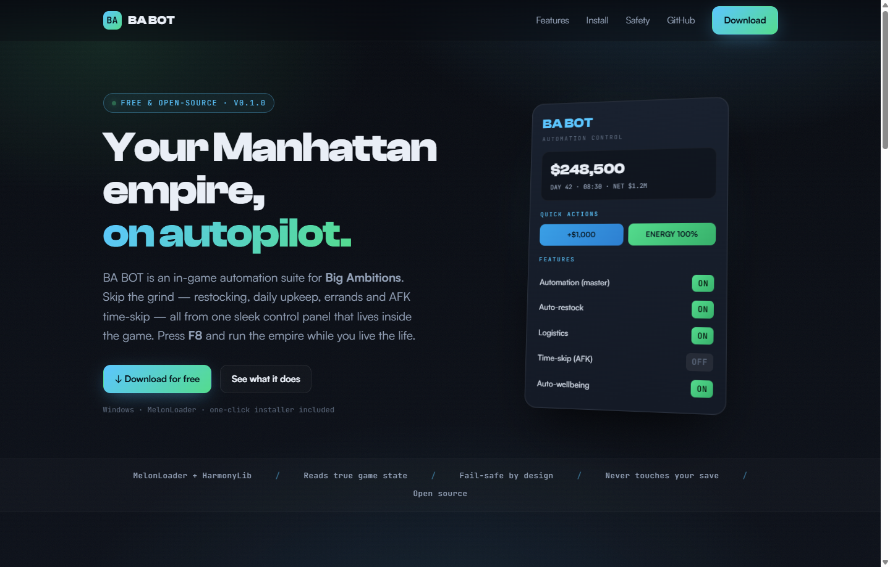

<div align="center">

# 🎛️ BA BOT

### Your Big Ambitions empire, on autopilot.

An in-game automation suite for **[Big Ambitions](https://store.steampowered.com/app/2127390/Big_Ambitions/)** — skip the grind (restocking, upkeep, errands, AFK time-skip) from one sleek control panel that lives inside the game. Press **F8**.

[**🌐 Website**](https://itsrealdennis.github.io/BigAmbitionsAutomation/) · [**⬇️ Download**](https://github.com/ItsRealDennis/BigAmbitionsAutomation/releases/latest) · [**🐛 Issues**](https://github.com/ItsRealDennis/BigAmbitionsAutomation/issues)


<br>



<sub>Hover any toggle in-game for a tooltip explaining what it does.</sub>

</div>

---

## ✨ Features

| | Feature | What it does |
|---|---|---|
| 🎛️ | **In-game control panel** | Polished F8 overlay styled to match the game — live cash, day & net worth, every toggle a tap away. |
| ⚡ | **Instant quick-actions** | One-click **+$1,000** and **Energy 100%** — useful the second you spawn, no shop needed. |
| ⏩ | **Time-skip (AFK)** | Fast-forwards the clock while your businesses keep earning. |
| ❤️‍🩹 | **Auto-wellbeing** | Keeps your energy topped up so you never stop to sleep/eat. |
| 🛡️ | **Click-safe overlay** | Panel clicks never leak into the world (hooked into the game's input layer). |
| 💾 | **Persistent settings** | Toggles + reserve floor saved across sessions. |
| 🇩🇰 | **English & Dansk** | Full English/Danish UI — switch in the panel; remembered across sessions. |
| 🔍 | **Preview-first & safe** | Every money move previews what it would do; flip **Live mode** on only when watching. Reserve floor + safety breakers never crossed. |
| 💰 | **Finance auto-pay** | Pays your taxes the moment they come due — the one money chore the game won't do for you. Reserve-floor gated. |
| 👔 | **Employees** | Morale bonus to unhappy staff when the game allows one, and completed training finished automatically. |
| 🎓 | **Train a person** *(preview)* | A **SKILLS** panel lists your staff — click **MAX** on anyone to bring their skill straight to 100%. Pick who you want; it does the rest. |
| 🚚 | **Logistics** | Sets up a repeating weekly import for any product running low, so stock keeps flowing. |
| 🔔 | **Earlier low-stock warning** *(preview)* | Extends the game's "stock running low" to-do note to fire more days ahead (the game's default is 2). Set your lead time in the panel. |
| 📦 | **Auto-restock** *(preview)* | Reads each shop's stock and restocks to target on the daily tick, gated by your reserve floor. |
| ⚖️ | **Service fee** *(opt-in)* | Optional challenge: charges in-game cash when automation does work for you, so leaning on the bot isn't free. Off by default; tune the fee in the panel. |

Automation is **default-OFF** and runs only through a plan → safety-gate → apply pipeline. Money-spending actions **preview** (log what they'd do) until you enable **Live mode** in the panel.

## ⬇️ Install (players)

**Subscribe on the Steam Workshop — nothing else to download.** BA BOT ships through Big Ambitions' official mod support (EA 0.11+), so there's no MelonLoader and no manual file copying.

1. Open the **BA BOT** Steam Workshop page (or the in-game **Mods** menu) and click **Subscribe**.
2. Launch Big Ambitions and make sure **BA BOT** is **enabled** in the in-game Mods list.
3. Load a save and press **F8** to open the control panel.

To remove: **Unsubscribe** in the Workshop (or disable it in the in-game Mods list). BA BOT never writes your save, so vanilla loads clean afterwards.

## 🛡️ Built to fail safe

- **Default-OFF** — does nothing until you opt in, feature by feature.
- **Reserve floor & shared budget** — never spends below the cushion you set, checked against the whole plan.
- **Safety breakers** — low funds / unpaid rent / empty inventory halt automation and say why.
- **Never writes your save** — settings live outside the save file; uninstall any time and load vanilla, clean.

## 🧱 Architecture (for developers)

The testable "brain" never touches the volatile game API:

| Project | TFM | Role |
|---|---|---|
| `src/BAA.Core` | netstandard2.1 | The brain. **Zero game refs.** Orchestration engine, safety gate + breakers, managers, config, adapter interfaces. Pure + unit-tested. |
| `src/BAA.BigAmbitions` | netstandard2.1 | The Steam Workshop mod (official EA 0.11 Mono API) — the **only** project that touches the game (adapter, Harmony low-stock patch, uGUI overlay). |
| `tests/BAA.Core.Tests` | net8.0 | xUnit (59 green) against in-memory fakes; runs with no game installed. |
| `tools/ApiDump` | net8.0 | Dumps the game's type/method/field surface for API discovery. |

```powershell
dotnet test  tests/BAA.Core.Tests/BAA.Core.Tests.csproj      # 59 tests, no game needed
dotnet build src/BAA.BigAmbitions/BAA.BigAmbitions.csproj -c Release
powershell -ExecutionPolicy Bypass -File tools/deploy-mod.ps1 # build + deploy to ModsLocal for in-game testing
```

Requirements to build: .NET 8 SDK and a local Big Ambitions install (EA 0.11+) — the mod references the game's managed assemblies under `Big Ambitions_Data/Managed`. See `docs/API-MAP.md` and `docs/UPDATE-RUNBOOK.md`.

## ⚠️ Disclaimer

Fan-made, single-player mod. Not affiliated with or endorsed by Hovgaard Games. Big Ambitions is in Early Access — mod at your own risk and back up your saves.
